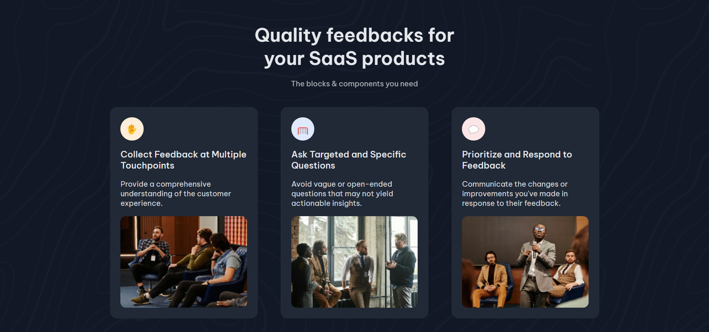

<!-- Please update value in the {}  -->

<h1 align="center">Simple Feature Section | devChallenges</h1>

   Solution for a challenge <a href="https://devchallenges.io/challenge/simple-feature-section-challenge" target="_blank">Simple Feature Section</a> from <a href="http://devchallenges.io" target="_blank">devChallenges.io</a>.

  <h3>
    <a href="https://simple-feature-section-seven.vercel.app/">
      Demo
    </a>
     | 
    <a href="https://github.com/Thaththathirian/simple-feature-section.git">
      Solution
    </a>
     | 
    <a href="https://devchallenges.io/challenge/simple-feature-section-challenge">
      Challenge
    </a>
  </h3>

<!-- TABLE OF CONTENTS -->

## Table of Contents

- [Overview](#overview)
  - [What I learned](#what-i-learned)
  - [Useful resources](#useful-resources)
- [Built with](#built-with)
- [Features](#features)
- [Contact](#contact)
- [Acknowledgements](#acknowledgements)

<!-- OVERVIEW -->

## Overview

### What I learned

- Improved my understanding of **CSS Grid** and **Flexbox** for layout structuring.
- Gained experience in **responsive design**, ensuring it looks great on all screen sizes.

### Useful resources

- [CSS Tricks - Flexbox Guide](https://css-tricks.com/snippets/css/a-guide-to-flexbox/) - Helped me understand and structure Flexbox properly.
- [MDN Web Docs - CSS Grid](https://developer.mozilla.org/en-US/docs/Web/CSS/CSS_Grid_Layout) - Provided a great reference for using CSS Grid effectively.

### Built with

- Semantic HTML5 markup
- CSS custom properties
- Flexbox
- CSS Grid
- Responsive Design

## Features

This application/site was created as a submission to a [DevChallenges](https://devchallenges.io/challenges-dashboard) challenge.

## Acknowledgements

- Thanks to **DevChallenges** for providing this challenge and an opportunity to improve my frontend skills.

## Author

- GitHub: [@Thaththathirian](https://github.com/Thaththathirian)
